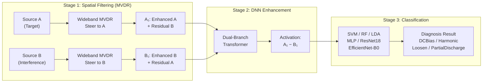
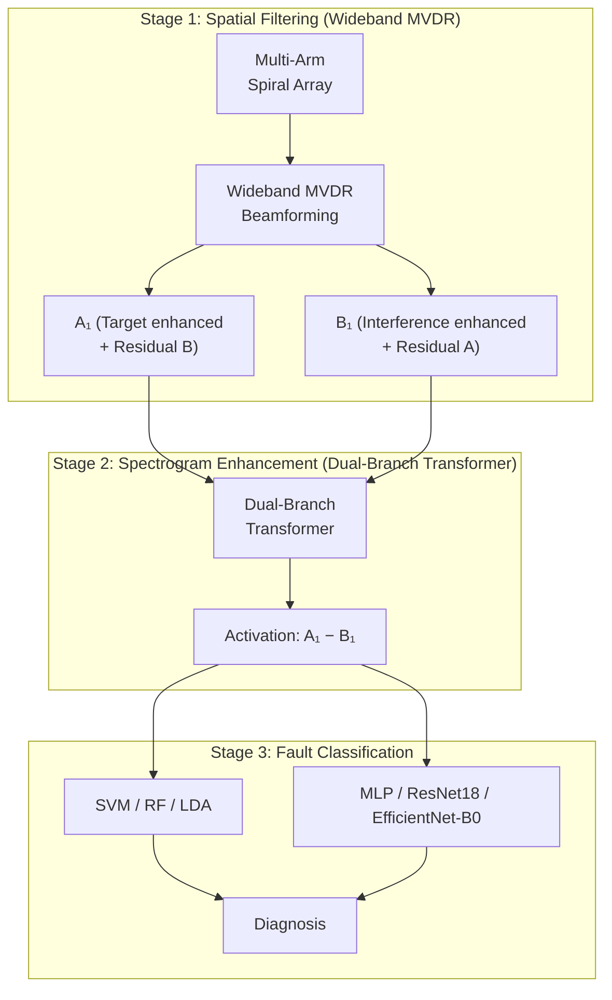
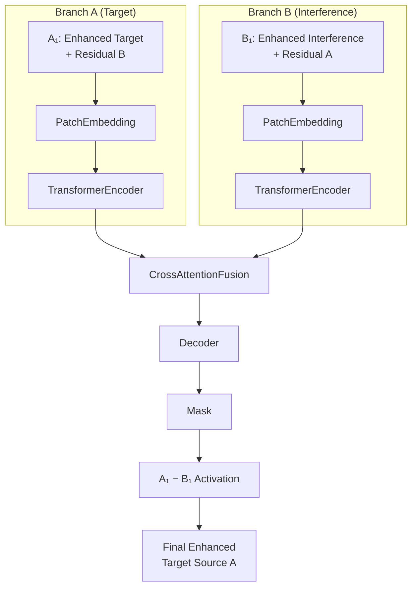

# MVDR-Based Acoustic Source Separation on Multi-Arm Spiral Array

> **Pipeline**: Multi-arm spiral array beamforming (MVDR) → Dual-Branch Transformer enhancement (A₁ − B₁) → Spectrogram-based fault classification

This project implements an end-to-end acoustic source separation and classification system, combining MVDR beamforming on a custom multi-arm spiral microphone array, deep learning-based residual interference suppression with a differential activation function, and multi-model classification.



---

## Problem

Acoustic source separation in multi-source environments faces two fundamental challenges:

1. **Spatial interference**: In reverberant environments, target acoustic signals are contaminated by strong competing sound sources. Single-microphone approaches cannot spatially discriminate the target source from interferers, resulting in poor Signal-to-Interference-plus-Noise Ratio (SINR).
2. **Residual interference after beamforming**: Even after spatial filtering via MVDR, the enhanced target source A₁ retains residual interference from source B, and vice versa. This residual contamination manifests as structured artifacts in time-frequency representations, degrading downstream classification performance.

**Goal**: Achieve robust, high-accuracy fault classification (DC Bias, Harmonic, Loosen, Partial Discharge) from acoustic signals captured in noisy, reverberant multi-source environments.

---

## Method

A three-stage pipeline combining **spatial filtering**, **deep learning enhancement with differential activation**, and **multi-model classification**:



### Pipeline Detail

| Stage                                | Technique                                                                | Key Innovation                                                                                                                                                                  |
| ------------------------------------ | ------------------------------------------------------------------------ | ------------------------------------------------------------------------------------------------------------------------------------------------------------------------------- |
| **1. Spatial Filtering**       | Wideband MVDR beamforming on custom multi-arm spiral array               | Separate steering toward Source A and Source B; Fraunhofer far-field steering vector construction; multi-$\beta$ parameter optimization; RIR-based propagation modeling       |
| **2. Spectrogram Enhancement** | Dual-Branch Transformer with**A₁ − B₁ differential activation** | Two MVDR-enhanced inputs fed into the DNN; activation function designed to compute A₁ − B₁, suppressing residual interference by canceling the common interference component |
| **3. Fault Classification**    | 6-model ensemble (SVM, RF, LDA, MLP, ResNet18, EfficientNet-B0)          | PCA dimensionality reduction; stratified K-Fold cross-validation; comprehensive metric suite                                                                                    |

### Core Insight: A₁ − B₁ Activation

The key innovation of this pipeline is the **differential activation function**:

- **A₁** = MVDR output steered toward Source A → contains enhanced A + residual B
- **B₁** = MVDR output steered toward Source B → contains enhanced B + residual A
- **A₁ − B₁** → cancels the common residual interference component, yielding a cleaner representation of Source A

This approach leverages the fact that the residual interference in both MVDR outputs shares a common structure, which can be suppressed through subtraction in the learned feature space of the Dual-Branch Transformer.

---

## Illustrative Figures

> **⚠️ Preliminary Results Notice**: The results shown below are **preliminary** and may not reflect the final performance. All figures are provided for **illustrative purposes only** and do not represent validated final results. Quantitative metrics are omitted pending further experimental validation. These figures correspond to those appearing in `paper/mvdr.tex`.

### Figure 1–3: Simulation Setup (RIR-Based, Narrowband)

| # | Figure | Description |
|---|--------|-------------|
| 1 |  | Room layout and microphone array configuration (3D) |
| 2 |  | Top-down view of room layout and array geometry |
| 3 |  | Power Spectral Density of target (2 kHz) and interference (4 kHz) signals |

### Figure 4–7: Eigenvalue & Multi-β Analysis (Narrowband Simulation)

| # | Figure | Description |
|---|--------|-------------|
| 4 |  | Covariance eigenspectrum at 2 kHz vs. fullband |
| 5 |  | Eigenvalue spectrum with signal-to-noise transition boundary |
| 6 |  | Eigenspectra as functions of wall reflection coefficient β |
| 7 |  | SNR gain, ISR gain, and condition number vs. β |

### Figure 8: MVDR Spectrogram Comparison (Narrowband)

| # | Figure | Description |
|---|--------|-------------|
| 8 |  | Input vs. target-steered vs. interference-steered MVDR spectrograms |

### Figure 9–11: Real Acoustic Signal Validation

| # | Figure | Description |
|---|--------|-------------|
| 9 |  | PSD of real target and interference signals after RIR convolution |
| 10 |  | Spectrogram comparison for real acoustic signals |
| 11 |  | Eigenspectra vs. β for real signal validation |

---

## System Setup

### Experiment Configuration

| Parameter                         | Value                                        |
| --------------------------------- | -------------------------------------------- |
| **Microphone array**        | 128-channel multi-arm spiral array           |
| **Room dimensions**         | 10 m × 5 m × 5 m                           |
| **Array center**            | (5, 2.5, 2.5)                                |
| **Source A (Target)**       | Located at (0, 0, 0)                         |
| **Source B (Interference)** | Located at (10, 5, 5)                        |
| **Sampling rate**           | 48 kHz                                       |
| **Acoustic fault types**    | DC Bias, Harmonic, Loosen, Partial Discharge |

### Equipment

| Equipment                    | Purpose                                       |
| ---------------------------- | --------------------------------------------- |
| 128-channel microphone array | Spatial acoustic acquisition                  |
| Tripod                       | Array mounting and positioning                |
| Two loudspeakers             | Source A (target) and Source B (interference) |
| PC + cable                   | Data acquisition and processing               |

---

## Table of Contents

- [Project Structure](#project-structure)
- [Illustrative Figures](#illustrative-figures)
- [System Setup](#system-setup)
- [Quick Start](#quick-start)
- [Module 1: MVDR Beamforming](#module-1-mvdr-beamforming)
- [Module 2: Dual-Branch Transformer](#module-2-dual-branch-transformer)
- [Module 3: Fault Classification](#module-3-fault-classification)
- [Paper &amp; Documentation](#paper--documentation)

---

## Project Structure

```text
.
├── mvdr/                      # MVDR beamforming (MATLAB)
│   ├── src/                   #   Core processing modules
│   ├── configs/               #   Experiment configurations
│   ├── data/                  #   Mic positions & audio
│   └── output/                #   Beamforming results & figures
├── transformer/               # Dual-Branch Transformer (Python/PyTorch)
│   ├── src/                   #   Model, training, data pipeline
│   ├── configs/               #   YAML configuration files
│   ├── scripts/               #   train.py, evaluate.py
│   ├── datasets-npz/          #   Input spectrogram data
│   ├── experiments/           #   Checkpoints, logs & enhancement reports
│   └── data/                  #   Collected batch pairwise data
├── classification/            # Fault classification (Python)
│   ├── data/                  #   Split datasets (train/val/test)
│   ├── results/               #   Model checkpoints & reports
│   ├── split_dataset.py       #   Dataset splitting & K-Fold
│   └── train_classifier.py    #   Multi-model training
├── RIR-Generator/             # Room impulse response generator (C++/MATLAB)
├── paper/                     # LaTeX paper & figures
│   ├── results/               #   Classification result figures (PNG)
│   ├── output/                #   MVDR output figures (PDF)
│   └── drawing/               #   System diagrams (PDF, Draw.io)
├── scripts/                   # Utility shell scripts
└── docs/                      # Extended documentation
```

---

## Quick Start

### 1. MVDR Beamforming

```bash
# MATLAB: Run the main MVDR pipeline
# Open MATLAB in mvdr/ directory, then:
mvdr_main
# or for multi-beta parameter sweep:
mvdr_multi_beta_analysis
```

### 2. Transformer Training & Data Generation

```bash
cd transformer
python scripts/train.py --config configs/train_pairwise.yaml
```

### 3. Recollect Figures

```bash
bash scripts/recollect_batch_pairwise.sh
```

### 4. Split Dataset for Classification

```bash
cd classification
python split_dataset.py                          # default: 70/15/15 with 5-fold CV
python split_dataset.py --k-folds 10             # 10-fold CV
python split_dataset.py --no-cv                  # skip K-Fold generation
python split_dataset.py --use-noisy              # use noisy spectrogram instead of enhanced
```

- **Data source**: `transformer/datasets-npz/{DCBias, Harmonic, Loosen, PartialDischarge}/*.npz`
- **Output dir**: `classification/data/`

### 5. Train Classifiers

```bash
cd classification
python train_classifier.py                  # train all models
python train_classifier.py --models svm rf  # train only SVM + Random Forest
python train_classifier.py --use-cv         # use K-Fold CV instead of fixed val split
python train_classifier.py --no-pca         # disable PCA dimensionality reduction
```

**Output**:

```text
classification/results/
├── model_comparison.csv
├── model_comparison.json
├── confusion_matrices.png
├── tsne_embedding.png
├── model_comparison.png
├── <model>_loss_accuracy.png      (MLP / Transfer Learning)
├── svm_report.json
└── ...
```

---

## Module 1: MVDR Beamforming

MVDR (Minimum Variance Distortionless Response) beamforming on a custom **multi-arm spiral microphone array** for directional acoustic signal acquisition.

### Pipeline

1. Two acoustic sources (Source A = target, Source B = interference) are captured by the 128-channel multi-arm spiral microphone array
2. Wideband MVDR beamforming is applied **separately** for each source:
   - **Steer toward Source A** → produces **A₁**: enhanced target A with residual interference from B
   - **Steer toward Source B** → produces **B₁**: enhanced interference B with residual from A
3. Both outputs are passed to the Dual-Branch Transformer for further enhancement via A₁ − B₁ activation

### Key Features

- Microphone coordinate reading & processing
- Room parameter configuration (RIR generation)
- 3D visualization of room, sources, and microphone array
- Fraunhofer far-field criterion verification
- RIR generation via `RIR-Generator`
- Signal convolution with noise addition
- STFT processing
- Steering vector construction based on actual positions
- Multi-$\beta$ parameter sweep analysis

### Usage

Modify the config name in `mvdr_main.m`:

```matlab
experiment_name = 'real_signal_dcbias_4k';   % or 'demo_2k_4k'
```

Then execute `mvdr_main.m`. For multi-$\beta$ analysis, modify `mvdr_multi_beta_analysis.m` similarly.

### Key Files

| File                                           | Description                     |
| ---------------------------------------------- | ------------------------------- |
| `src/mvdr_main.m`                            | Main MVDR pipeline              |
| `src/mvdr_processing_module.m`               | Core MVDR processing            |
| `src/rir_generation_module.m`                | RIR generation wrapper          |
| `src/load_config.m`                          | Configuration loader            |
| `src/load_data_module.m`                     | Data loading utilities          |
| `src/diagnostics_and_visualization_module.m` | Visualization tools             |
| `src/mvdr_multi_beta_analysis.m`             | Multi-$\beta$ parameter sweep |
| `src/batch_mvdr_raw_datasets.m`              | Batch processing for datasets   |

### MVDR Output Figures

All MVDR analysis figures are generated under:

- `mvdr/output/real_signal/figures/` — Beampattern, PSD comparison, eigenspectra, signal spectrograms
- `mvdr/output/real_signal/multi_beta_comparison/` — β parameter sweep results
- `paper/output/demo_2k_4k/figures/` — Simulation results (2 kHz & 4 kHz demo)

---

## Module 2: Dual-Branch Transformer

A dual-branch Transformer model for **residual interference suppression**. The model takes two MVDR-enhanced spectrograms as input (A₁ and B₁) and applies a differential activation function (A₁ − B₁) to cancel common-mode residual interference.

### Model Architecture (Dual-Branch Transformer with A₁ − B₁ Activation)



### Activation Function: A₁ − B₁

The key innovation is the **differential activation function** designed as:

$$
\text{Enhanced}(t, f) = \text{Mask}(t, f) \odot \bigl[\mathbf{A}_1(t, f) - \mathbf{B}_1(t, f)\bigr]
$$

where:

- $\mathbf{A}_1(t, f)$ = MVDR output steered toward Source A (target + residual B)
- $\mathbf{B}_1(t, f)$ = MVDR output steered toward Source B (interference + residual A)
- $\text{Mask}(t, f)$ = learned time-frequency mask from the Dual-Branch Transformer

The subtraction $\mathbf{A}_1 - \mathbf{B}_1$ cancels the **common-mode residual interference** that appears in both MVDR outputs, leaving a cleaner representation of the target source.

### Why This Works

| Component            | Content                                                                          |
| -------------------- | -------------------------------------------------------------------------------- |
| **A₁**        | Target A (strong) + Residual B (weak)                                            |
| **B₁**        | Interference B (strong) + Residual A (weak)                                      |
| **A₁ − B₁** | Target A (strong) − Interference B (strong) + (Residual B − Residual A) (weak) |

After the DNN learns to apply a time-frequency mask optimized for source separation, the residual difference term is suppressed, yielding a high-quality estimate of the target source A.

> **NOTE**:
>
> - Training runs on a remote server; results are saved remotely. Use `Remote Host` to check file locations.
> - Errors and package installations must be resolved on the remote server's terminal.
> - `num_frames = (audio_duration × sample_rate - n_fft) // hop_length + 1`. Adjust `input_size` time dimension accordingly.
> - `num_workers = 0`
> - New datasets renamed locally will NOT sync to remote. Rename on the remote server directly.

| Component                       | Description                                                                       |
| ------------------------------- | --------------------------------------------------------------------------------- |
| **PatchEmbedding**        | Splits 2D time-frequency map into patches and maps to tokens                      |
| **TransformerEncoder**    | Shared encoder processing target (A₁) and interference (B₁) branches separately |
| **CrossAttentionFusion**  | Cross-attention + gating mechanism to learn the A₁ − B₁ cancellation mask      |
| **Decoder**               | Decodes tokens to time-frequency mask and upsamples to original size              |
| **DualBranchTransformer** | Main model; outputs`enhanced = mask × (A₁ − B₁)` and the learned mask       |

### CrossAttentionFusion — 3 Suppression Modes

Three suppression modes are available (default: `frequency_aware`):

| Mode                | Mechanism                                                                               | Use Case                                               |
| ------------------- | --------------------------------------------------------------------------------------- | ------------------------------------------------------ |
| `adaptive`        | Soft gating$z_s - g \cdot z_{cross}$                                                  | Baseline comparison                                    |
| `aggressive`      | Dual suppression: amplify interference → subtract + enhance difference                 | Strong noise                                           |
| `frequency_aware` | Frequency-aware: detect horizontal stripes → enhance recognition → aggressive removal | Remove horizontal noise stripes**(recommended)** |

**Frequency-Aware Mode** adds asymmetric convolution detection:

- **Horizontal detector** (long kernel `kernel_size=5`): Detects frequency-domain continuity (noise stripe features)
- **Vertical detector** (short kernel `kernel_size=3`): Detects vertical speech structure (harmonics/formants)

$$
\text{stripe\_score} = \text{concat}(h_{\text{response}}, 1 - v_{\text{response}})
$$

$$
\text{freq\_attention} = \text{stripe\_enhancer}(\text{stripe\_score})
$$

### Training

#### Local Training (Recommended First)

```bash
cd transformer
python scripts/train.py --config configs/train.yaml
```

#### Evaluation (No Re-Training)

```bash
cd transformer
python scripts/evaluate.py --config configs/train.yaml \
    --checkpoint experiments/train/best_model.pth \
    --output-dir enhancement_report --num-samples 20
```

#### Data Generation (Pairwise Mode)

```bash
python transformer/scripts/train.py --config transformer/configs/train_pairwise.yaml
```

#### Docker Training

```bash
docker compose up --build
```

Configuration is specified in `docker-compose.yaml`. The container training script is defined by `Dockerfile` and `docker-compose.yaml`.

**Common checks**:

- Config file exists: `train.yaml`
- Training script exists: `train.py`
- Data directories have content: `data/speech_enhancement/clean` and `data/speech_enhancement/noise`

### Data Processing & Dataset

`SpeechEnhancementDataset` supports two modes:

- Real data directory (`clean/`, `noise/`, optional `noisy/`)
- Auto-generate synthetic samples when no data exists

Provides: audio loading, noisy synthesis (random SNR), Mel spectrogram construction, size alignment, dual-channel features (`mel + delta`).

#### Data Mixing Modes

| Mode          | Clean-Noise Relation | Implementation          | Use Case                  | Advantage                  |
| ------------- | -------------------- | ----------------------- | ------------------------- | -------------------------- |
| Fixed Pairing | One-to-one           | `clean[i] + noise[i]` | Specific room/device      | Simulates real environment |
| Random Mixing | No correspondence    | `clean[i] + noise[j]` | General noise suppression | High data diversity        |

This project uses **random mixing**, which:

- Increases data diversity ($N_{clean} \times N_{noise}$ combinations)
- Trains the model to learn general noise suppression (not memorizing specific pairs)
- Avoids overfitting to specific noise types, improving generalization

#### Dataset Split Strategy

```text
Total Data (100%)
├── Training Set (70%)   — Model learning
├── Validation Set (15%) — Hyperparameter tuning & early stopping
└── Test Set (15%)       — Final evaluation (fully independent)
```

Clean and noise files are split independently:

| Split     | Description                                                      |
| --------- | ---------------------------------------------------------------- |
| Clean Set | Independently split into`train_clean / val_clean / test_clean` |
| Noise Set | Independently split into`train_noise / val_noise / test_noise` |

**Advantages**:

- Prevents data leakage: test set clean files never pair with training set noise files
- Handles unequal counts: clean and noise can have different numbers of files
- Ensures fair evaluation: testing only uses `test_clean + test_noise` combinations

#### Data Directory Structure

```text
data/speech_enhancement/
├── clean/                # Clean speech files
│   ├── speech_001.wav
│   ├── speech_002.wav
│   └── ...
├── noise/                # Noise files
│   ├── noise_001.wav
│   ├── noise_002.wav
│   └── ...
└── noisy/                # (Optional) Pre-generated noisy speech
    ├── noisy_001.wav
    └── ...
```

### Training & Validation

- **`compute_loss`**: Composite loss (enhanced MSE + mask reconstruction MSE + sparse regularization)
- **`train_one_epoch`**: Standard training loop (backpropagation, gradient clipping, logging)
- **`validate`**: Validation set loss evaluation
- **`main`**: Complete training pipeline (config, DataLoader, optimizer, scheduler, best/checkpoint saving)

### Evaluation & Visualization

- **`evaluate_speech_quality`**: Statistics (MSE, SNR before/after, improvement; PESQ/STOI interfaces reserved but not currently computed)
- **`save_enhanced_audio`**: Saves enhanced results as `.npz` spectrogram data
- **`visualize_spectrogram_comparison`**: Generates 4-panel comparison (clean/noisy/enhanced/mask)
- **`generate_enhancement_report`**: Outputs image + text report

### Evaluation Metrics

| Metric          | Description                          | Range           | Better    |
| --------------- | ------------------------------------ | --------------- | --------- |
| SNR Improvement | Signal-to-noise ratio improvement    | dB              | ↑ Higher |
| MSE             | Spectrogram mean squared error       | $[0, \infty)$ | ↓ Lower  |
| PESQ*           | Perceptual speech quality            | $[1, 4.5]$    | ↑ Higher |
| STOI*           | Short-time objective intelligibility | $[0, 1]$      | ↑ Higher |

*\*Interface reserved, not currently computed.*

### Visual Quality Assessment

| Comparison        | Good Performance                      | Poor Performance          |
| ----------------- | ------------------------------------- | ------------------------- |
| Noisy vs Clean    | —                                    | Large red noise regions   |
| Enhanced vs Clean | Similar spectrogram structure         | Over-smoothed / distorted |
| Mask Distribution | Noise region ≈ 0, speech region ≈ 1 | All 0 or all 1            |
| SNR Improvement   | Substantial increase                   | Marginal or negative      |

**Color guide**:

- Spectrogram (`inferno` colormap): Red = high energy, Black = low energy
- Mask (`viridis` colormap): Yellow = retain (≈1), Purple = suppress (≈0)

**Visual inspection**:

- **Noisy spectrogram**: Visible horizontal stripes (periodic noise) or random spots (broadband noise)
- **Enhanced spectrogram**: Noise texture disappears; speech formants (horizontal stripes) become clearer
- **Mask**: Noise regions appear deep purple (suppressed); speech regions appear yellow (retained)

### Inference & Utilities

- **`test_inference`**: Random input shape/value range check
- **`prepare_dataset_structure`**: Generates data directory template
- **`generate_and_save_noisy_audio`**: Batch generates noisy audio and writes to `noisy/`

### Environment

- Framework: PyTorch
- Dependencies: `numpy`, `matplotlib`, `librosa`, etc.
- Docker containerization supported

---

## Module 3: Fault Classification

Multi-model classification on enhanced spectrograms for acoustic fault diagnosis.

### Dataset Classes

| Class             | Label | Description          |
| ----------------- | ----- | -------------------- |
| DC Bias           | 0     | DC bias fault        |
| Harmonic          | 1     | Harmonic distortion  |
| Loosen            | 2     | Mechanical looseness |
| Partial Discharge | 3     | Partial discharge    |

### Models (Ordered by Recommendation for Small Datasets)

| # | Model                             | Type           | Strengths                                |
| - | --------------------------------- | -------------- | ---------------------------------------- |
| 1 | **SVM** (RBF kernel)        | Traditional ML | Best for small, structured data          |
| 2 | **Random Forest**           | Ensemble       | Robust, handles noise well               |
| 3 | **LDA**                     | Linear         | Great if classes are linearly separable  |
| 4 | **MLP** (small)             | Neural Network | Strong regularization                    |
| 5 | **Transfer Learning** (CNN) | Deep Learning  | Treats spectrograms as images            |
| 6 | **EfficientNet-B0**         | Deep Learning  | Pre-trained CNN for image classification |

### Metrics

| Metric           | Description                         |
| ---------------- | ----------------------------------- |
| Top-1 Accuracy   | Overall classification accuracy     |
| Precision        | Class-wise precision                |
| Recall           | Class-wise recall                   |
| F1-Score         | Harmonic mean of precision & recall |
| G-Mean           | Geometric mean of class-wise recall |
| ROC-AUC (OVR)    | One-vs-rest ROC AUC                 |
| Confusion Matrix | Per-class prediction breakdown      |
| Parameter Count  | Model size (PyTorch models)         |
| FLOPs            | Computational cost (PyTorch models) |

---

## Paper & Documentation

- **Paper**: `paper/mvdr.tex` (LaTeX, IEEE format)
- **Bibliography**: `paper/MVDR.bib`
- **Figure standards**: `docs/IEEE_COLOR_STANDARD.md`, `docs/IEEE_FIGURE_DESCRIPTIONS.md`
- **Multi-$\beta$ analysis**: `docs/MULTI_BETA_ANALYSIS.md`, `docs/README_MULTI_BETA.md`
- **MVDR theory**: `docs/mvdr_of_real_signal_based_on_rir.md`
- **Project structure**: `docs/PROJECT_STRUCTURE.md`
- **Figure caption reference**: `docs/FIGURE_CAPTION_QUICK_REF.md`
